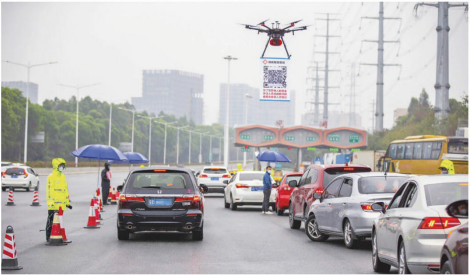

###### China | The Economist February 29th 2020 | Page `46-47`

||
|:---:|
||

#### `Surveillance technology | 监视技术`
##  Code red | 红色条规

**China is using its high-tech methods of controlling people to `curb` an
`epidemic`**
中国正利用高科技手段控制人口以遏制流行病

```
> surveil       [sɜː'veɪl]        vt. 使受监视/监督； 对...实施监视/监督
  surveillance  [sɜː'veɪləns]      n. 监视；监督
> code red                            红色条规
> curb          [kɜːrb]           vt. 抑制
> epidemic      [ˌepɪ'demɪk]       n. 流行病；传染病
                                 adj. 流行的；传染性的
> pandemic      [pæn'demɪk]        n. 流行病
                                 adj. 广泛流行的
+ pandemic is an epidemic that is geographically widespread; occurring
  throughout a region or even throughout the world
  在地理上广泛传播的流行病；在一个地区甚至全世界发生
```


### `P1`
When the covid-19 virus started spreading in China, and the government began
`locking down` the country, Shen Dacheng's friends called her a `prophet`. Her
short story "Miss Box Man", published in 2018, is set in a world of
`virus-induced` fear. The rich live in `sealed` containers which protect them
from the `pathogen`. For the rest, life is a constant series of `compulsory`
blood tests and `hosings-down` with `disinfectant`. Those found with the virus
are `seized`. Some are killed `on the spot`. `Sensors` are hidden every where,
looking out for `carriers`.
> 当covid-19病毒开始在中国传播，政府开始封锁中国时，沈大成被她的朋友们称为
> 先知。她在2018年出版的短篇小说《Miss-Box Man》以病毒引发的恐惧为背景。富
> 人生活在密封的容器里，容器可以保护富人们免受病原体的侵害。对于其他人来说，
> 生活就是一系列的强制性血液检查和消毒。那些被发现携带病毒的人被扣押，有的
> 当场死亡。到处都藏有寻找病毒携带者的传感器。

```
> lock down                           锁住
> prophet       ['prɒfɪt]          n. 预言者；先知
> induce        [ɪn'djuːs]        vt. 引起；促使
> seal          [siːl]             v. 密封
                                   n. 海豹
                                   n. 封条；印章
> pathogen      ['pæθədʒən]        n. 病菌；病原体
> compulsory    [kəm'pʌlsəri]    adj. 强制的；义务的
> disinfectant  [ˌdɪsɪn'fektənt] adj. 消毒的
                                   n. 消毒剂
> seize         [siːz]             v. 抓住
> on the spot                         在现场
>        spot   [spɒt]             n. 地点；场所 adj. 现场的
> sensor        ['sensər]          n. 传感器
> carrier       ['kæriər]          n. 航空母舰；带菌者
```


### `P2`
China's `non-fictional` `epidemic` has `echoes` of that `dystopia`, `minus` the
`caskets` and the killings. Take Ms Sun, who lives with her son and husband in
the eastern city of Hangzhou. The city's health-check app `flagged` her as a
possible carrier of the virus after she reported a runny nose through its
self-assessment form. She had just returned from her `native` province in the
north-west, where she had met people from Hubei, the province `at the centre of`
the `outbreak` that has `infected` more than 65,000 people in China and killed
about 2,600 others since December.
> 中国现实中的流行病对沈大成小说中描述的人间地狱产生了共鸣，除了棺材和杀戮。
> 让我们以一家三口居住在杭州市东部的孙女士为例，在她通过自我评估表报告其有
> 流鼻涕症状后，该市的健康检查应用将她标记为病毒的可能携带者。因为她刚刚从
> 位于中国西北部的老家返回，在那里她遇到了来自湖北的人。而湖北省是疫情爆发
> 的中心，自去年12月以来，该省已经感染了6.5万多人，造成约2600人死亡。

```
> fictional     ['fɪkʃənl]       adj. 虚构的；小说的
> echo          ['ekəʊ]            n. 回声；重复；共鸣
> epidemic      [ˌepɪ'demɪk]       n. 流行病；传染病
                                 adj. 流行的；传染性的
> dystopia      [dɪs'təʊpiə]       n. 反面乌托邦；非理想化的地方；地狱般的处境
> minus         ['maɪnəs]        adj. 负的；减的
                                   n. 减号；负数
                                prep. 减去
> casket        ['kɑːskɪt]         n. 棺材；首饰盒
> flag          [flæɡ]            vt. (以旗帜)标出 n. 旗帜
> native        ['neɪtɪv]        adj. 本国的；本土的；当地的
                                   n. 本国人；本地人；土著
> at the centre of               adj. 在...的中心
> outbreak      ['aʊtbreɪk]        n. 爆发；暴动
> infect        [ɪn'fekt]          n. 感染；传染
```


### `P3`
The red colour of the QR code on Ms Sun's "Hangzhou Health Code" app
`indicated` that she was supposed to be `undergoing` 14 days of
`self-quarantine`. Had the code been yellow, it would have meant she was a
lower risk and had to `isolate` herself for seven days. For free passage around
the city, people must `produce` their phones at `checkpoints` and show they
have a green QR code. Pictured is another method of `keeping tabs on` people:
drivers have to scan the code `held up` by a `drone` to `register` for entry
into the city, in this case Shenzhen.

> 孙女士的"杭州健康码"应用程序上二维码的红色表明她应该接受为期14天的自我
> 隔离。 如果二维码呈黄色，那就意味着她风险较低，必须隔离7天。为了在城市
> 能够自由通行，人们必须在检查站拿出手机出示绿色二维码。图为另一种监视方
> 法：司机必须扫描无人机持有的代码才能注册进入深圳。

```
> indicate      ['ɪndɪkeɪt]        v. 表明；指示
> undergo       [ˌʌndə'ɡəʊ]       vt. 经历；遭受
> quarantine    ['kwɒrəntiːn]     vt. 检疫
                                   n. 隔离
> self-quarantine                  n. 自我隔离
> isolate       ['aɪsəleɪt]       vt. 使孤立；隔离
> produce       [prə'djuːs]        v. 出示；生产
> checkpoint    ['tʃekpɔɪnt]       n. 检查站
> keep tab on                      v. 记录；监视
> hold up                             举起；支撑
> drone         [drəʊn]            n. 雄蜂；无人机
> register      ['redʒɪstər]       v. 登记；注册；挂号
```


### `P4`
Ms Sun's app did not offer her a chance to explain that she has `chronic`
`rhinitis`, a common `nasal` `condition`. Only after an `appeal` to the
local government and a visit from `neighbourhood` officials was her red
status changed to green, allowing her to move around Hangzhou again.

> 孙女士的应用并没有给她一个解释自己患有慢性鼻炎（一种常见的鼻部疾病）
> 的机会。在向当地政府提出上诉和社区工作人员探访之后，她的红色身份才变
> 成了绿色，从而再次获得了在杭州自由活动的权利。

```
> chronic       ['krɒnɪk]        adj. 长期的；慢性的
> rhinitis      [raɪ'naɪtɪs]       n. 鼻炎
> nasal         ['neɪzl]         adj. 鼻的；鼻声的
                                   n. 鼻音
> condition     [kən'dɪʃn]         n. 疾病  #LAS5.282
> appeal        [ə'piːl]           n. 恳求；呼吁；上诉
  appeal to sb (to do sth)            恳请某人（做某事）
> neighbourhood ['neɪbəhʊd]        n. 社区；街坊四邻
> neighbourhood official              居委会工作人员
```

### `P5`
Much of China's success so far in `containing` the virus's spread outside Hubei
has depended on `mobilising` `legions` of people to `man` `checkpoints` armed
with `clipboards` and `thermometer` guns, or to go door-to-door `making note
of` `sniffles`. But as the daily number of newly confirmed cases of covid-19
continues to fall in China, and the government `struggles` to get the economy
going again after more than a month of `paralysis`, officials will rely more
heavily on `surveillance` technology to prevent a `resurgence` of the virus. It
will enable them to `adopt` a more `tailored` approach, allowing most people to
`resume` their normal lives while monitoring those who might be infected.

> 迄今为止，中国将病毒控制在湖北以外地区传播方面取得的成功，很大程度上依赖
> 于动员大批人员设立检查站，这些检查站配备有剪贴板和测体温枪；或者挨家挨户
> 地记录是否有患感冒的情况。但随着中国每天新确诊的covid-19病例数量的持续下
> 降，以及政府试图让经济在瘫痪一个多月后恢复正常，官员们将更加依赖监控技术
> 来预防病毒的死灰复燃。这将使官员们能够采取一种更加有针对性的方法，让大多
> 数人的生活得以恢复正常，同时监测那些可能被感染的人。

```
> contain       [kən'teɪn]        vt. 抑制；容纳
> mobilise      ['məʊbɪlɑɪz]       v. 动员
> legion        ['liːdʒən]         n. 军团；众多的人
                                 adj. 很多的
> man           [mæn]              v. 为...配备人手
> checkpoint    ['tʃekpɔɪnt]       n. 检查站
> clipboard     ['klɪpbɔːd]        n. 剪贴板；付有纸夹的笔记板
> thermometer   [θə'mɒmɪtə(r)]     n. 温度计
> make note of                        记录，做笔记
> sniffle       ['snɪfl]           v. (尤指因哭泣或患感冒)抽鼻子
> struggle      ['strʌɡl]          v. 奋斗；斗争；抗争
> paralysis     [pə'ræləsɪs]       n. 瘫痪；停顿
> surveillance  [sɜː'veɪləns]      n. 监视；监督
> resurgence    [rɪ'sɜːdʒəns]      n. 复活
> adopt         [ə'dɒpt]           v. 采用；收养
> tailored      ['teɪləd]        adj. 特制的，定做的
> resume        [rɪ'zjuːm]         v. 重新开始
                                   n. 简历；履历；摘要
```

### `P6`
Smartphones, which are carried by most working-age Chinese, will be powerful
tools. They are already used `extensively` by police to track people's
movements and monitor their online `behaviour`. Covid-19 offers the government
an `incentive` and an excuse to `exploit` their capabilities more fully, this
time in `pursuit` of data that could help the `clipboard-carriers` identify
their targets. As other countries worry about a possible `pandemic` of
covid-19, they will watch China to see whether its digital `snooping` can
provide lessons in how to control the virus's spread.

> 大多数处于工作年龄段的中国人所携带的智能手机将成为强大的工具。它们已经被警
> 方广泛用于跟踪人们的行踪和监控他们的网络行为。Covid-19为政府提供了一个激励
> 和借口，让他们更充分地发挥自己的能力，这次是为了寻找能够帮助剪贴板运营商识
> 别目标的数据。当其他国家担心covid-19可能大流行时，他们将观察中国的数字监听
> 是否能提供如何控制病毒传播的经验教训。

```
> extensively   [ɪk'stensɪvli]   adv. 广泛地；大规模地
> behaviour     [bɪ'heɪvjər]       n. 行为；举止；品行
> incentive     [ɪn'sentɪv]      adj. 刺激的；鼓励的
                                   n. 刺激；鼓励；动机
> exploit       [ɪk'splɔɪt]       vt. 利用；开发；剥削
> pursuit       [pə'sjuːt]         n. 追求
  + in pursuit of                     追求
    e.g. He wasted his life in the vain pursuit of pleasure.
         他为了追求享乐而白白虚度了一生。
> clipboard-carriers                  剪贴板运营商
> pandemic      [pæn'demɪk]        n. 流行病
                                 adj. 广泛流行的
> snoop         [snuːp]           vi. 窥探；打听
```


### `P7`
It is often `assumed` that the `surveillance` systems used by China's security
services are highly integrated and offer an `abundance` of `up-to-the-minute`
`intelligence` on almost every `citizen`. In the far-western province of
Xinjiang, there may be some truth in this. Data `culled` from smartphones and
`ubiquitous` `facial-recognition` cameras are used to identify people there
whom `the authorities` regard as `threatening`: `devout` Muslims or those with
a `fondness` for Xinjiang's non-Han cultures. Such information has helped the
government `round up` more than 1m people and `put them in`
"re-education centres".

> 人们通常认为，中国安全部门使用的监控系统高度集成，为几乎每个公民提供最新
> 的情报。在遥远的西部省份新疆，这可能有一些事实。从智能手机和无处不在的面
> 部识别摄像头中提取的数据被用来识别那些被当局视为威胁的人：虔诚的穆斯林或
> 对新疆非汉族文化有好感的人。这些信息帮助政府抓捕了100多万人， 并将他们安
> 置在“再教育中心”。

```
> surveillance  [sɜː'veɪləns]      n. 监视；监督
> assume        [ə'sjuːm]         vt. 假定；(想当然的)认为
> abundance     [ə'bʌndəns]        n. 丰富；充裕
> up-to-the-minute               adj. 最新的
> intelligence  [ɪn'telɪdʒəns]     n. 情报；智力；理解力
> citizen       ['sɪtɪzn]          n. 公民；市民
> cull          [kʌl]              v. 拣选；剔除
> ubiquitous    [juː'bɪkwɪtəs]   adj. 到处存在的
> facial        ['feɪʃl]         adj. 脸部的；面部的
> recognition   [ˌrekəɡ'nɪʃn]      n. 承认；认出
> facial-recognition                  面部识别
> the authorities                     当局；官方
> threaten      ['θretn]           v. 威胁；恐吓
> devout        [dɪ'vaʊt]        adj. 虔诚的
> fondness      [fɒndnəs]          n. 喜爱；爱好
> round         [raʊnd]          adj. 圆的 v. 弄圆
> round up                            使集中
> put sb in                           把sb放在...位置 强调位置关系
  put sb into                         使sb处于...状态 强调一个状态
```


### `P8`
But those efforts `involve` only a single province. Creating such systems is
far harder when it `entails` data-sharing between provinces, or between
`provincial and central authorities`. Co-operation is `undermined` by
competition for `favour` in Beijing. The boss of a foreign
`artificial-intelligence` developer in China says that `fusing` `datasets`
within a single firm is often quick, but not if it involves co-operation
between different `institutions`. "The person `in charge` is unwilling to
`take the risk`," he says, and usually `reckons` that doing nothing is safer
than sharing.

> 但这些努力只涉及一个省。如果需要在各省之间或中央与地方之间共享数据，那么
> 创建这样的系统就要困难得多。在中央那里争夺利益的竞争破坏了合作。在中国的
> 一位外国人工智能开发人员的老板说，在一家公司内融合数据集通常很快，但如果
> 涉及到不同机构之间的合作，就不行了。“负责人不愿意冒险，”他说，通常认为什
> 么都不做比分享更安全。

```
> involve       [ɪn'vɒlv]         vt. 牵涉；使卷入 #LAS5.743
  involve sb in doing sth             要求/允许sb参与sth
> entail        [ɪn'teɪl]         vt. 需要，使必须 #LAS5.453
                :    to involve something or make it necessary
                e.g. Does your job entail much travelling? 你的工作需要出差吗？
> provincial    [prə'vɪnʃl]      adj. 省的；地方的
> central       ['sentrəl]       adj. 中心的；中央的
> undermine     [ˌʌndə'maɪn]      vt. 逐渐削弱；暗中损害
> favour        ['feɪvər]          n. 赞同，支持；帮忙，恩惠 #LAS5.502
> artificial-intelligence [ˌɑːtɪ'fɪʃəl ɪn'telɪdʒəns] 人工智能
> fuse          [fjuːz]            v. 使结合，使融合 #LAS5.570
> dataset       ['deɪtəset]        n. 数据集
> institution   [ˌɪnstɪ'tjuːʃn]    n. 大型团体，机构 #LAS5.730
> be in charge                        负责 #LAS5.221
  e.g. Who is in charge? 谁是负责人？
       He is in charge of the finances. 他负责财务。
> take a risk                         冒险 #LAS5.1199
  e.g. Are you willing to take the risk? 你愿意冒这个险吗？
       I couldn't take the risk of leaving him alone. 我不能冒险把他单独留下。
> reckon        ['rekən]           v. (口)认为；估计 #LAS5.1151
```


### `P9`
Even with the best of technology and the most `joined-up` of `bureaucracies`,
tracking covid-19 would be difficult. Other diseases that have caused global
alarm this century, such as Ebola and SARS, have been easier to monitor because
those infected have quickly shown `symptoms`, unlike those with the covid-19
virus.

> 即使拥有最先进的技术和最协同的官僚机构，追踪covid-19也很困难。本世纪引
> 起全球恐慌的其他疾病，如埃博拉和非典，由于感染者很快出现症状，而不像那
> 些携带covid-19病毒的疾病，因此更容易监测到。

```
> joined-up                      adj. 协调的；连笔的 #LAS5.754
  : systems, institutions etc combine different groups, ideas, or parts
    in a way that works well
  e.g. joined-up government 协同政府
> bureaucracy   [bjʊə'rɒkrəsi]     n. 官僚；官僚制度；官僚主义 #LAS5.177
> symptom       ['sɪmptəm]         n. 症状；征兆
```


### `P10`
A "close-contact" app being developed with much `fanfare` by a `state-owned`
firm, China Electronics Technology Group Corporation, therefore should be
viewed with `scepticism`. (The company is also responsible for much of the
surveillance technology deployed in Xinjiang.) The app is supposed to provide
officials with data drawn from the National Health Commission, the Ministry of
Transport, China Railway and the `Civil Aviation Administration of China` to
track citizens' travel, health and contacts with infected people. But it is not
clear how work on this is `proceeding`, if it is `at all`.

> 因此，中国电子科技集团公司正在大张旗鼓地开发一款"密切接触"的应用程序，应该
> 持怀疑态度。（该公司还负责在新疆部署的大部分监控技术）。该应用程序应向官员
> 提供从国家卫生委员会、交通运输部、中国铁路和中国民航局获取的数据，以跟踪公
> 民的旅行、健康和与感染者的接触。但目前尚不清楚这方面的工作是如何进行的，如
> 果真是这样的话。

```
> fanfare       ['fænfeə(r)]       n. 号角花彩（欢迎仪式等上奏的响亮短曲）
> state-owned   [steɪt'əʊnd]     adj. 国营的
> scepticism    ['skeptɪsɪzəm]     n. 怀疑态度
  sceptical     ['skeptɪkl]      adj. 怀疑的 #(英)skeptical
> civil         ['sɪvl]          adj. 公民的；民用的
> aviation      [ˌeɪvi'eɪʃn]       n. 航空
> Civil Aviation Administration of China 中国民航局
> proceeding    [prə'siːd]        vi. 继续进行；开始；着手
> at all
  + 用于否定句时，  意为"丝毫；根本"， (not at all 一点也不)
  + 用于疑问句时，  意为"究竟；到底"，
  + 用于条件句时，常译为"当真；实在"，
  + 用于肯定句中，  意为"竟然"，表示说话人的某种情绪或情感（如怀疑或惊奇等）。
```


### `P11`
For now, China's `digital` monitoring methods for covid-19 are a `hodgepodge`
of `disjointed` efforts by city and provincial governments, as well as the
technology `giants` Alibaba and Tencent. `Witness` the `self-assessment` system
that `ensnared` Ms Sun. It is being `rolled out` by Ant Financial, an Alibaba
`affiliate` that runs Alipay, a `ubiquitous` payment app. Two hundred cities
are now using it, says Alibaba, after its `trial` in Hangzhou. Ant Financial
eventually plans to offer it `nationwide`.

> 目前，中国对covid-19的数字监控方法是一个大杂烩，城市和省级政府以及技术巨头
> 阿里巴巴和腾讯的努力脱节。诱骗孙女士的自我评估系统就是例证。这项计划正由阿
> 里巴巴旗下运营支付宝的蚂蚁金服推出，支付宝是一款无处不在的支付应用。阿里巴
> 巴在杭州试点后表示，目前已有200个城市在使用它。 蚂蚁金服最终计划在全国范围
> 内推出。

```
> digital       ['dɪdʒɪtl]       adj. 数字的；数码的
> hodgepodge    ['hɒdʒpɒdʒ]        n. 大杂烩 (美)hotchpotch #LAS5.681
> disjointed    [dɪs'dʒɔɪntɪd]   adj. 杂乱的
> giant         ['dʒaɪənt]       adj. 巨大的
                                   n. 巨人；巨物；大公司
> witness       ['wɪtnəs]          n. 目击者；证人
                                  vt. 目击；见证
> assessment    [ə'sesmənt]        n. 评价；评估
  self-assessment                     自我评估
> ensnare       [ɪn'sneə(r)]       v. 诱捕
> roll out                            铺开；推出
> affiliate     [ə'fɪlieɪt]        n. 分公司；附属机构
> ubiquitous    [juː'bɪkwɪtəs]   adj. 到处存在的
> trial         ['traɪəl]          n. 试验；试用
> nationwide    [ˌneɪʃn'waɪd]    adj. 全国性的     #LAS5.917
                                 adv. 在全国范围内
+ worldwide     ['wɜːldwaɪd]     adj. 全世界的     #LAS5.1603
                                 adv. 在全世界范围内
```


### `P12`
A `representative` of Ant Financial says the app, which is `bundled` with
Alipay, is `merely` a `conduit` for data `compiled` by the government.
Tencent's WeChat, a social-media platform, offers a similar app using data
from the same source. It has been introduced in Tencent's home town, Shenzhen.
Such `non-state firms` may be best-equipped to harness data to good effect in
the `battle` against the virus. Unlike government bodies, they have a
`cohesive` nationwide view of their customers and ready access to `intimate`
details about them.

> 蚂蚁金服的一位代表说，与支付宝捆绑在一起的应用程序只是政府收集数据的渠道。
> 腾讯微信，一个社交媒体平台，提供了一个类似的应用程序，使用来自同一来源的
> 数据。它已经在腾讯的老家深圳推出。这类非国有企业可能最有能力利用数据在抗
> 击病毒的战斗中取得良好效果。与政府机构不同的是，他们在全国范围内对客户有
> 一个统一的看法，随时可以了解客户的详细情况。

```
> representative [ˌreprɪ'zentətɪv] n. 代表；众议员
> bundle        ['bʌndl]           n. 捆；束
                                   v. 捆；把...扎成一捆
> merely        ['mɪəli]         adv. 仅仅；只不过
> conduit       ['kɒndɪt]          n. 导管；水管；沟渠
> compile       [kəm'paɪl]         v. 收集，搜集
> non-state                           非国有的
  state-owned   [steɪt'əʊnd]     adj. 国营的
> firm          [fɜːm]             n. 公司；商行
> battle        ['bætl]            n. 战斗
> cohesive      [kəʊ'hiːsɪv]     adj. 粘性的
> intimate      ['ɪntɪmət]       adj. 亲密的；私人的 #LAS5.739
```


### `P13`
Both Alipay and WeChat `harvest` their users' location data. Through WeChat,
Tencent knows who its users talk to. WeChat Pay and Alipay know who receives
their users' money. Both Tencent and Ant Financial know what travel tickets
their users have bought through the companies' `respective` apps. They have
better real-time `awareness` of what Chinese people are doing and discussing
than the government itself.

> 支付宝和微信都会收集用户的位置数据。通过微信，腾讯知道用户和谁说话。微信
> 支付和支付宝知道谁收到用户的钱。腾讯和蚂蚁金服都知道用户通过各自的应用程
> 序购买了哪些旅行票。他们比政府更能实时地了解到中国人在做什么和讨论什么。

```
> harvest       ['hɑːvɪst]         v. 收获；收割
> respective    [rɪ'spektɪv]     adj. 各自的；分别的
> awareness     [ə'weənəs]         n. 认识；觉察
```


### `P14`
People in China, as well as in `democracies`, worry about how tech companies
use the data they `garner` from their customers. But if covid-19 becomes a
`pandemic`, they may well become more `inclined` to forgive a more `nosy` use
of personal data if doing so helps `defeat` the virus.

> 中国和民主国家的人们都担心科技公司如何使用从客户那里获得的数据。但是，如果
> covid-19成为一种流行病，如果这样做有助于战胜病毒的话，他们很可能会更倾向于
> 宽容那些对个人数据的更多管闲事的使用。

```
> democracy     [dɪ'mɒkrəsi]       n. 民主国家；民主；民主制
> garner        ['ɡɑːnə(r)]        v. 收集
> pandemic      [pæn'demɪk]        n. 流行病
                                 adj. 广泛流行的
> incline       [ɪn'klaɪn]         v. (使)倾向于
> nosy          ['nəʊzi]         adj. 好管闲事的；爱追问的
> defeat        [dɪ'fiːt]         vt. 战胜；击败
```


###### REFERENCES
1. [February 29th-March 6th 2020][901]
2. [经济学人·商论][902]

[901]: https://getmyte.com/2020/02/29/Feb-29th-2020/
[902]: https://www.economistasia.com/asia/pds/cn/baidu/moleskine/splitter/
